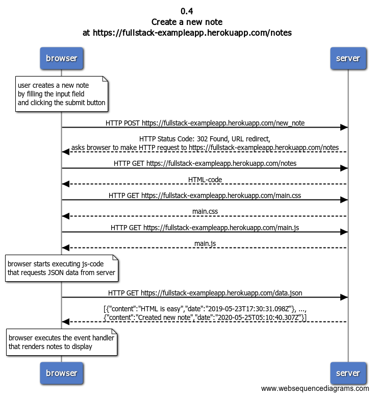

# Exercise 0.4: Create a note

## Problem statement

Create a diagram depicting the situation where the user creates a new note on page https://fullstack-exampleapp.herokuapp.com/notes by writing something into the text field and clicking the submit button.
If necessary, show operations on the browser or on the server as comments on the diagram.
The diagram does not have to be a sequence diagram. Any sensible way of presenting the events is fine.

## Solution

### Diagram



### Steps to create the diagram

```
title 0.4 \nCreate a new note \nat https://fullstack-exampleapp.herokuapp.com/notes

note over browser:
user creates a new note
by filling the input field
and clicking the submit button
end note

browser->server: HTTP POST https://fullstack-exampleapp.herokuapp.com/new_note

server-->browser: HTTP Status Code: 302 Found, URL redirect, \nasks browser to make HTTP request to https://fullstack-exampleapp.herokuapp.com/notes

browser->server: HTTP GET https://fullstack-exampleapp.herokuapp.com/notes

server-->browser: HTML-code

browser->server: HTTP GET https://fullstack-exampleapp.herokuapp.com/main.css

server-->browser: main.css

browser->server: HTTP GET https://fullstack-exampleapp.herokuapp.com/main.js

server-->browser: main.js

note over browser:
browser starts executing js-code
that requests JSON data from server
end note

browser->server: HTTP GET https://fullstack-exampleapp.herokuapp.com/data.json

server-->browser: [{"content":"HTML is easy","date":"2019-05-23T17:30:31.098Z"}, ..., \n{"content":"Created new note","date":"2020-05-25T05:10:40.307Z"}]

note over browser:
browser executes the event handler
that renders notes to display
end note
```
