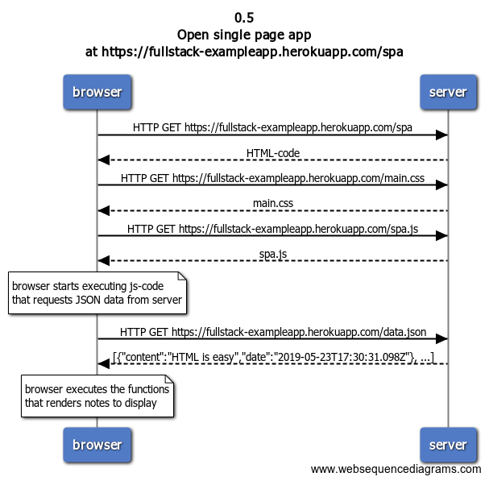

# Exercise 0.5: Open single page app

## Problem statement

Create a diagram depicting the situation where the user goes to the single page app version of the notes app at https://fullstack-exampleapp.herokuapp.com/spa.

## Solution

### Diagram



### Steps to create the diagram

```
title 0.5 \nOpen single page app \nat https://fullstack-exampleapp.herokuapp.com/spa

browser->server: HTTP GET https://fullstack-exampleapp.herokuapp.com/spa

server-->browser: HTML-code

browser->server: HTTP GET https://fullstack-exampleapp.herokuapp.com/main.css

server-->browser: main.css

browser->server: HTTP GET https://fullstack-exampleapp.herokuapp.com/spa.js

server-->browser: spa.js

note over browser:
browser starts executing js-code
that requests JSON data from server
end note

browser->server: HTTP GET https://fullstack-exampleapp.herokuapp.com/data.json

server-->browser: [{"content":"HTML is easy","date":"2019-05-23T17:30:31.098Z"}, ...]

note over browser:
browser executes the functions
that renders notes to display
end note
```
