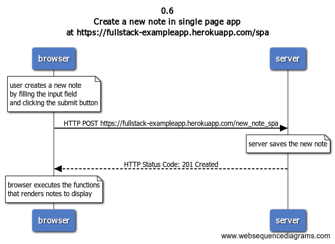

# Exercise 0.6: Create a note in single page app

## Problem statement

Create a diagram depicting the situation where user creates a new note using the single page version of the app.

## Solution

### Diagram



### Steps to create the diagram

```
title 0.6 \nCreate a new note in single page app \nat https://fullstack-exampleapp.herokuapp.com/spa

note over browser:
user creates a new note
by filling the input field
and clicking the submit button
end note

browser->server: HTTP POST https://fullstack-exampleapp.herokuapp.com/new_note_spa

note over server:
server saves the new note
end note

server-->browser: HTTP Status Code: 201 Created

note over browser:
browser executes the functions
that renders notes to display
end note
```
